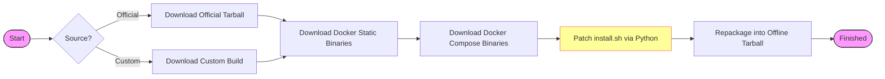

# 1Panel v2 Offline Package Generator

<p align="center">
  <a href="README_zh.md"></a>
  <a href="https://github.com/1Panel-dev/1Panel"></a>
  
  
</p>

A specialized utility to generate **Air-Gapped (Offline) Installation Packages** for 1Panel v2.

This tool solves the "chicken-and-egg" problem of installing modern containerized software in restricted networks: it bundles the Docker engine and Docker Compose binaries *inside* the 1Panel installer, modifying the installation logic to use these local assets instead of downloading them.

## 📖 Table of Contents

- [How It Works](#-how-it-works)
- [Prerequisites](#-prerequisites)
- [Usage Guide](#-usage-guide)
- [Command Reference](#-command-reference)
- [Outputs](#-outputs)
- [Installation Instructions](#-installation-instructions)
- [Developer Notes](#-developer-notes)

## 💡 How It Works

The generator performs a "Patch & Repack" operation:



## ✅ Prerequisites

Ensure you have the following tools available in your environment (Linux/macOS/WSL):
*   `bash`: The script interpreter.
*   `curl`: For downloading upstream resources.
*   `tar`: For extracting and repacking archives.
*   `python3`: **Critical**. Used to safely patch the `install.sh` script without breaking complex logic.

## 🛠️ Usage Guide

### 1. Basic Build (Recommended)
Generate an offline package for the latest stable version of 1Panel. This will download the official online package and convert it.

```bash
cd v2
chmod +x prepare_offline.sh
./prepare_offline.sh
```

### 2. Advanced Build
Specify versions for 1Panel, Docker, or support multiple architectures at once.

```bash
./prepare_offline.sh \
  --app_version v2.0.13 \
  --mode stable \
  --arch "amd64,arm64" \
  --docker_version 24.0.7 \
  --compose_version v2.23.0
```

## 📚 Command Reference

| Flag | Default | Description |
| :--- | :--- | :--- |
| `--app_version` | *Latest Stable* | The 1Panel version to package (e.g., `v2.10.0`). |
| `--mode` | `stable` | Update channel: `stable`, `beta`, or `dev`. |
| `--arch` | *All* | Target architectures. Comma/space separated (e.g., `amd64,arm64`). |
| `--source` | `both` | `official` (Official Releases), `custom` (GitHub Releases), or `both`. |
| `--custom_repo` | *Default Repo* | The GitHub repository to fetch custom builds from (if source is custom). |
| `--docker_version` | `24.0.7` | The version of Docker Static binaries to bundle. |
| `--compose_version` | `v2.23.0` | The version of Docker Compose to bundle. |
| `--allow-missing` | `false` | If true, missing architecture artifacts will warn instead of fail. |
| `--interactive` | `false` | Interactive mode to confirm versions. |

## � Outputs

Build artifacts are stored in the `build/` directory, organized by version and source.

```text
build/
└── v2.0.13/
    ├── checksums.txt                                      # SHA256 Checksums
    ├── official/
    │   └── 1panel-v2.0.13-official-offline-linux-amd64.tar.gz
    └── custom/
        └── 1panel-v2.0.13-custom-offline-linux-amd64.tar.gz
```

## 💿 Installation Instructions

### End-User Installation (Offline)

1.  **Transfer**: Copy the `offline` tarball to your server via USB, SCP, etc.
2.  **Install**:
    ```bash
    tar -zxf 1panel-v2.0.13-official-offline-linux-amd64.tar.gz
    cd 1panel-v2.0.13-official-offline-linux-amd64
    sudo ./install.sh
    ```
    > The installer will detect the bundled Docker binaries and install them automatically.

### End-User Upgrade (Offline)

1.  **Transfer**: Copy the same package to the server.
2.  **Upgrade**:
    ```bash
    tar -zxf ...tar.gz
    cd ...
    sudo ./upgrade.sh
    ```
    > **Note**: `upgrade.sh` is a special script added by this generator. It handles service stopping, binary replacement, and config migration safely.

## �‍💻 Developer Notes

**Injection Mechanics**:
The script uses python to locate specific markers in `install.sh` (like `PASSWORD_MASK` or `Install_Docker` function definitions) and injects code that points to the local `docker.tgz` and `docker-compose` files. This ensures that even as the official `install.sh` changes slightly, the patch remains robust as long as the anchors exist.

---
<p align="center">Made with ❤️ by the Open Source Community</p>
