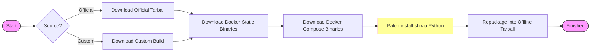

# 1Panel v2 Offline Package Generator

<p align="center">
  <a href="README_zh.md"></a>
  <a href="https://github.com/1Panel-dev/1Panel"></a>
  
  
</p>

A specialized utility to generate **Air-Gapped (Offline) Installation Packages** for 1Panel v2.

This tool solves the "chicken-and-egg" problem of installing modern containerized software in restricted networks: it bundles the Docker engine and Docker Compose binaries *inside* the 1Panel installer, modifying the installation logic to use these local assets instead of downloading them.

## 📖 Table of Contents

- [How It Works](#-how-it-works)
- [Prerequisites](#-prerequisites)
- [Usage Guide](#-usage-guide)
- [Command Reference](#-command-reference)
- [Outputs](#-outputs)
- [Installation Instructions](#-installation-instructions)
- [Developer Notes](#-developer-notes)

## 💡 How It Works

The generator performs a "Patch & Repack" operation:


```mermaid
flowchart LR
    Start([Start]) --> Source{Source?}
    Source -- "Official" --> GetOff[Download Official Tarball]
    Source -- "Custom" --> GetCust[Download Custom Build]
    
    GetOff & GetCust --> GetDocker[Download Docker Static Binaries]
    GetDocker --> GetCompose[Download Docker Compose Binaries]
    
    GetCompose --> Patch[Patch install.sh via Python]
    Patch --> Repack[Repackage into Offline Tarball]
    
    Repack --> End([Finished])
    
    style Start fill:#f9f,stroke:#333
    style End fill:#f9f,stroke:#333
    style Patch fill:#ff9,stroke:#f66
```

## ✅ Prerequisites

Ensure you have the following tools available in your environment (Linux/macOS/WSL):
*   `bash`: The script interpreter.
*   `curl`: For downloading upstream resources.
*   `tar`: For extracting and repacking archives.
*   `python3`: **Critical**. Used to safely patch the `install.sh` script without breaking complex logic.

## 🛠️ Usage Guide

### 1. Basic Build (Recommended)
Generate an offline package for the latest stable version of 1Panel. This will download the official online package and convert it.

```bash
cd v2
chmod +x prepare_offline.sh
./prepare_offline.sh
```

### 2. Advanced Build
Specify versions for 1Panel, Docker, or support multiple architectures at once.

```bash
./prepare_offline.sh \
  --app_version v2.3.2 \
  --mode stable \
  --arch "amd64,arm64" \
  --docker_version 29.8.2 \
  --compose_version v5.6.0
```

## 📚 Command Reference

| Flag | Default | Description |
| :--- | :--- | :--- |
| `--app_version` | *Latest Stable* | The 1Panel version to package (e.g., `v2.10.0`). |
| `--mode` | `stable` | Update channel: `stable`, `beta`, or `dev`. |
| `--arch` | *All* | Target architectures. Comma/space separated (e.g., `amd64,arm64`). |
| `--source` | `both` | `official` (Official Releases), `custom` (GitHub Releases), or `both`. |
| `--custom_repo` | *Default Repo* | The GitHub repository to fetch custom builds from (if source is custom). |
| `--docker_version` | Per-architecture source lock | Exact local override; release requires a reviewed lock. |
| `--compose_version` | Per-architecture source lock | Exact local override; release requires a reviewed lock. |
| `--allow-missing` | `false` | If true, missing architecture artifacts will warn instead of fail. |
| `--interactive` | `false` | Interactive mode to confirm versions. |

## � Outputs

Build artifacts are stored in the `build/` directory, organized by version and source.

```text
build/
└── v2.3.2/
    ├── checksums.txt                                      # SHA256 Checksums
    ├── official/
    │   └── 1panel-v2.3.2-official-offline-linux-amd64.tar.gz
    └── custom/
        └── 1panel-v2.3.2-custom-offline-linux-amd64.tar.gz
```

## 💿 Installation Instructions

### End-User Installation (Offline)

1.  **Transfer**: Copy the `offline` tarball to your server via USB, SCP, etc.
2.  **Install**:
    ```bash
    tar -zxf 1panel-v2.3.2-official-offline-linux-amd64.tar.gz
    cd 1panel-v2.3.2-official-offline-linux-amd64
    sudo ./install.sh
    ```
    > The installer will detect the bundled Docker binaries and install them automatically.

### End-User Upgrade (Offline)

1.  **Transfer**: Copy the same package to the server.
2.  **Upgrade**:
    ```bash
    tar -zxf ...tar.gz
    cd ...
    sudo ./upgrade.sh
    ```
    > **Note**: `upgrade.sh` is a special script added by this generator. It handles service stopping, binary replacement, and config migration safely.

## �‍💻 Developer Notes

**Injection Mechanics**:
The patch replaces the complete reviewed `Install_Docker` function, preserves surrounding top-level calls, and validates Bash syntax. Unknown layouts fail instead of silently retaining the online Docker path. Actual current-upstream and v2.3.2 release fixtures are regression-tested.

---
<p align="center">Made with ❤️ by the Open Source Community</p>

## Fail-closed build and release contract

The default Docker and Compose downloads are pinned by architecture in
`docker-sources.json` and `compose-sources.json`, including exact URLs, versions,
byte counts and SHA-256. Docker currently uses 29.8.2 for amd64/arm64/armv7,
29.7.2 for ppc64le/loong64/riscv64 and 29.7.1 for s390x; Compose is v5.6.0.
These are independently maintained builds on the less common architectures;
version differences are deliberate, visible in the manifest, and are not a
claim that older builds have identical security fixes. Updating pins requires
actual archive download, hash and ELF verification. Explicit version overrides
request that exact version and never silently fall back; non-pinned overrides
are recorded in the manifest but lack a pre-reviewed expected hash.

Every package must contain Docker's eight binaries (including docker-init),
Compose, docker.service, upgrade.sh, a successfully patched install.sh and an
`offline-manifest.json`. The build verifies archive integrity, safe member paths,
ELF class/machine/endianness, mandatory payload presence and shell syntax.
Manifests record exact input URLs, versions, byte counts and hashes, plus all
bundled Docker binary hashes. Download failure, unknown upstream patch layout,
or invalid/missing payload fails the build. No downloaded binary is executed
by these checks; native runtime/container smoke tests remain a separate gate
for a deployment claim. New Docker installation currently requires systemd.

For v2.3.2 the reviewed matrix has custom builds for all seven architectures and
official builds for six, excluding official loong64 because that exact upstream
asset was absent. This exception is version-specific, not a claim that loong64
is unsupported. Other versions default to the complete 2 × 7 matrix. Update a
versioned matrix only after reviewing upstream assets; transient download errors
must never be encoded as an unsupported architecture. `--allow-missing` is only
for local partial builds; CI never uses it and a zero-output run always fails.

CI builds and validates the complete matrix before creating a draft release,
verifies every uploaded asset's server SHA-256 digest, and publishes the draft
only after every check passes. Existing public releases are never overwritten
piecemeal. Correcting an existing release needs a reviewed new tag/process.
Checksums use flat filenames so `sha256sum -c checksums.txt` works after download.

Run regression tests with `python3 -m unittest discover -s tests -v`.

For a correction, select the original application `version` and a new
`release_tag` (for example `v2.3.2-offline.1`). Asset names and input provenance
continue to identify the original application version. The release gate rejects
unpinned Docker/Compose versions even when allowed for local experiments.

### Enterprise originals and Docker-enhanced packages (v2.3.2)

Enterprise upstream publishes amd64 and arm64. For each, CI produces two clearly
named assets in addition to the thirteen community packages (17 total):

- `enterprise-original-offline`: the upstream archive is byte-identical; its
  official SHA-256 is verified. Original means unmodified, not that Docker is
  included. The inspected v2.3.2 enterprise archive includes the offline app
  store but still has an online Docker installation route.
- `enterprise-docker-offline`: adds the reviewed Docker/Compose/service payloads
  and patches only install.sh. The upstream inner directory name is preserved
  because official enterprise upgrade.sh validates it. The original upgrade.sh,
  appstore.tar.gz and every other original file are retained byte-for-byte.

Run `python3 scripts/prepare_enterprise.py --version v2.3.2 --arch amd64`
(or arm64). Streaming repacking avoids unpacking the large app store. The gate
checks the original archive against enterprise-sources-v2.3.2.json, verifies all
application and Docker ELF architectures, and compares every unchanged enhanced
member against the original archive. The enhanced package does not use the
community upgrade script. Tests distinguish package integrity and mocked install
flow from real privileged/native architecture installation tests.

### Explicit repair of an existing public release

Routine CI still refuses to overwrite public assets. For an explicitly reviewed
same-release repair, `scripts/repair_release.py` is plan-only unless `--execute`
is supplied. It first validates the entire supplied matrix, stages replacements,
checks server digests and downloads the staged bytes for verification, downloads
and hashes the old bytes, then renames old assets to recoverable `.backup-*`
names before assigning canonical names to replacements. Checksums are switched
last. Notes record replacement and backup hashes. No asset is deleted.

Supply `--repo`, `--tag`, `--version`, `--matrix`, `--directory` and a new
`--journal` path. Review the plan before explicit execution. Keep the journal;
it records IDs, old/new names, hashes and each transition. On failure, the tool
reads actual remote state and attempts to restore original names and notes,
retaining staged bytes. An incomplete rollback requires review of the journal
before another action. GitHub has no atomic multi-asset switch: a brief naming
transition is possible, and this tool does not claim otherwise. The reviewed matrix may include missing assets, such as new enterprise variants.
They use the same staging/readback flow; rollback restores their staged names
without deleting bytes. Unchanged canonical assets remain part of checksum and
final-matrix verification. Concurrent human release-note edits are preserved.

Custom upstream builds now require the upstream schema-1 manifest.json before any
patching: exact application version/architecture, immutable source/installer/build
repository commits, and a complete per-file hash/size inventory. Downstream
validates the original inventory, preserves manifest.json, records its hash and
provenance in offline-manifest.json, and verifies every unchanged upstream member
again at the release gate. Legacy custom artifacts without that manifest are
rejected; rebuild the upstream package first rather than weakening the gate.

Before upstream release promotion, verified GitHub Actions artifacts can be used
locally with `--custom-package-dir <download-directory>`,
`--custom-source-url <exact-public-Actions-run-URL>` and
`--expected-build-commit <full-40-character-commit>`. The directory must contain
each archive and its exact `.tar.gz.sha256` sidecar. The importer verifies bytes,
manifest identity and expected CI build commit, records the real run URL and
artifact name, and never records private download URLs, tokens or local paths.
