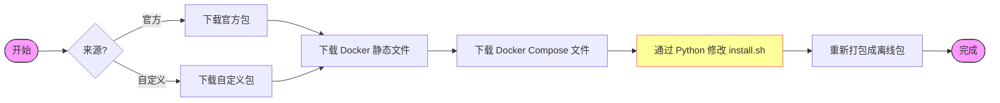

# 1Panel v2 离线包生成器

<p align="center">
  <a href="README.md"></a>
  <a href="https://github.com/1Panel-dev/1Panel"></a>
  
  
</p>

一个用于生成 1Panel v2 **全离线安装包**的专用工具。

该工具解决了在受限网络（内网/无互联网）环境中安装现代容器化软件的“鸡生蛋”问题：它将 Docker 引擎和 Docker Compose 二进制文件直接**内置**到 1Panel 安装包中，并修改安装逻辑以使用这些本地资源，而不再尝试下载。

## 📖 目录

- [工作原理](#-工作原理)
- [前置要求](#-前置要求)
- [使用指南](#-使用指南)
- [命令参考](#-命令参考)
- [输出目录](#-输出目录)
- [安装指南](#-安装指南)
- [开发者说明](#-开发者说明)

## 💡 工作原理

生成器执行“补丁与重打包”操作：



## ✅ 前置要求

确保您的环境（Linux/macOS/WSL）中已安装以下工具：
*   `bash`: 脚本解释器。
*   `curl`: 用于下载上游资源。
*   `tar`: 用于解压和重打包。
*   `python3`: **关键组件**。用于安全地修补 `install.sh` 脚本而不破坏复杂的逻辑。

## 🛠️ 使用指南

### 1. 基础构建（推荐）
为 1Panel 最新稳定版生成离线包。这将下载官方在线包并进行转换。

```bash
cd v2
chmod +x prepare_offline.sh
./prepare_offline.sh
```

### 2. 高级构建
指定 1Panel 版本、Docker 版本，或一次性支持多个架构。

```bash
./prepare_offline.sh \
  --app_version v2.3.2 \
  --mode stable \
  --arch "amd64,arm64" \
  --docker_version 29.8.2 \
  --compose_version v5.6.0
```

## 📚 命令参考

| 标志 | 默认值 | 说明 |
| :--- | :--- | :--- |
| `--app_version` | *最新稳定版* | 要打包的 1Panel 版本 (例如 `v2.10.0`)。 |
| `--mode` | `stable` | 更新通道：`stable`, `beta`, 或 `dev`。 |
| `--arch` | *全部* | 目标架构。逗号或空格分隔 (例如 `amd64,arm64`)。 |
| `--source` | `both` | `official` (官方发布), `custom` (GitHub 发布), 或 `both`。 |
| `--custom_repo` | *默认仓库* | 获取自定义构建的 GitHub 仓库 (如果来源是 custom)。 |
| `--docker_version` | 按架构锁定来源 | 本地精确版本覆盖；发布必须通过审核后的来源锁。 |
| `--compose_version` | 按架构锁定来源 | 本地精确版本覆盖；发布必须通过审核后的来源锁。 |
| `--allow-missing` | `false` | 如果为真，缺失架构构件时仅警告而不报错。 |
| `--interactive` | `false` | 交互模式以确认版本。 |

## 📂 输出目录

构建产物存储在 `build/` 目录中，按版本和来源组织。

```text
build/
└── v2.3.2/
    ├── checksums.txt                                      # SHA256 校验和
    ├── official/
    │   └── 1panel-v2.3.2-official-offline-linux-amd64.tar.gz
    └── custom/
        └── 1panel-v2.3.2-custom-offline-linux-amd64.tar.gz
```

## 💿 安装指南

### 终端用户安装（离线）

1.  **传输**：通过 USB、SCP 等方式将 `offline` 离线包复制到服务器。
2.  **安装**：
    ```bash
    tar -zxf 1panel-v2.3.2-official-offline-linux-amd64.tar.gz
    cd 1panel-v2.3.2-official-offline-linux-amd64
    sudo ./install.sh
    ```
    > 安装程序会自动检测内置的 Docker 二进制文件并自动安装。

### 终端用户升级（离线）

1.  **传输**：将相同的包复制到服务器。
2.  **升级**：
    ```bash
    tar -zxf ...tar.gz
    cd ...
    sudo ./upgrade.sh
    ```
    > **注意**：`upgrade.sh` 是此生成器添加的特殊脚本。它负责安全地停止服务、替换二进制文件和迁移配置。

## 👨‍💻 开发者说明

**注入机制**：
补丁替换已审核的完整 `Install_Docker` 函数，保留周围顶层调用并校验 Bash 语法。无法识别的结构直接失败，不能静默保留在线安装路径。测试覆盖当前上游及实际 v2.3.2 发布包的安装脚本。

---
<p align="center">Made with ❤️ by the Open Source Community</p>

## 离线包完整性和发布门禁

默认 Docker/Compose 使用 `docker-sources.json` / `compose-sources.json` 中按架构锁定的真实下载地址、版本、文件大小和 SHA-256。Docker 的 amd64/arm64/armv7 为 29.8.2，ppc64le/loong64/riscv64 为 29.7.2，s390x 为 29.7.1；Compose 为 v5.6.0。特殊架构由独立项目维护，版本差异不代表安全修复完全一致。显式指定版本时不会静默降级；未锁定的版本没有预审核哈希，来源仍写入清单。

构建必须包含 Docker 全部八个二进制（含 docker-init）、Compose、服务文件、升级脚本、完成离线补丁的安装脚本及 offline-manifest.json。检查压缩包完整性、路径安全、ELF 架构/位数/字节序、必需文件、补丁和 Bash 语法。下载失败、补丁结构不匹配、错误架构、载荷缺失都会失败，不能发布空壳离线包。校验不会执行下载的二进制或安装器；目标架构的实际运行验证仍需单独进行。全新 Docker 离线安装当前要求 systemd。

v2.3.2 的审核矩阵为 custom 七架构 + official 六架构（仅该版本 official loong64 上游资产缺失）。其他版本默认完整 2×7 矩阵，不能因临时下载失败自动删掉架构。CI 禁止 --allow-missing，先完成全部构建和校验，再向草稿发布上传，核对服务器端每个文件的 SHA-256 后才公开。已有公开版本不会逐文件覆盖，修复版本需审核新的标签/发布流程。checksums.txt 使用与下载资产一致的扁平文件名。

回归测试：`python3 -m unittest discover -s tests -v`。

修复发布时，version 保留原应用版本，release_tag 使用新标签（如 v2.3.2-offline.1）。资产名称和来源记录仍对应原应用版本。发布门禁拒绝未锁定的 Docker/Compose 版本，即使本地实验允许指定其他版本。

### 企业版原包与 Docker 增强包（v2.3.2）

企业版上游提供 amd64、arm64，两种架构分别生成两个明确区分的资产；加上社区版 13 个，共 17 个：
- enterprise-original-offline：原始压缩包逐字节保留并核对上游 SHA-256。原包并不等于已包含 Docker；已检查的 v2.3.2 原包包含离线应用商店，但 Docker 安装仍有联网路径。
- enterprise-docker-offline：仅修改 install.sh 的 Docker 安装逻辑，增加经校验的 Docker、Compose、服务文件和来源清单。保留原始包内目录名，避免破坏官方 upgrade.sh 对目录名的校验；官方 upgrade.sh、appstore.tar.gz 及其他原文件逐字节保留，不套用社区升级脚本。

构建：`python3 scripts/prepare_enterprise.py --version v2.3.2 --arch amd64`（也支持 arm64）。发布前核对企业原包官方哈希、程序 ELF 架构、Docker 载荷与增强包中所有应保留文件。打包采用流式重组，无需展开大型应用商店。完整性校验/模拟安装测试不能替代目标架构上的真实提权安装测试。

### 明确授权的原 Release 修复

常规 CI 仍禁止自动覆盖公开资产。`scripts/repair_release.py` 默认只输出计划，显式 `--execute` 才执行同一 Release 的修复：先校验完整矩阵，临时上传替换件，核对服务器摘要并下载回读；原件也下载计算哈希，然后把原件改名为可恢复的 `.backup-*`，再把新件切换为正式名称。checksums 最后切换，说明记录新旧哈希，全程不删除资产。

必须保留 `--journal` 记录。失败时先读取真实远端状态，再尝试恢复原名称和说明；回滚不完整时需要人工复核，不能盲目重试。GitHub 不提供多资产原子切换，短暂名称切换窗口不可避免。审核矩阵也可以包含尚不存在的企业版资产；新增件同样先暂存并回读，回滚时恢复暂存名而不删除。未变更正式资产也必须通过最终矩阵和校验和验证；并发人工说明编辑会保留。

Custom 上游包现在必须先提供 schema-1 manifest.json：准确应用版本/架构、源码/安装器/构建仓库不可变提交，以及完整逐文件哈希/大小。下游在修改前校验原清单，保留 manifest.json 并记录其哈希和来源，再于发布门禁校验所有未修改的原文件。缺少该清单的旧 custom 包会被拒绝，必须先修复并重建上游，不能放宽门禁冒充最终可发布资产。

上游正式发布前，可使用已经下载的 CI 产物：`--custom-package-dir <目录>`、`--custom-source-url <准确的公开 Actions 运行链接>`、`--expected-build-commit <完整40位提交>`。目录必须同时包含压缩包和对应 `.tar.gz.sha256`。导入时校验实际字节、清单版本/架构和预期构建提交，来源记录真实运行链接和资产名，不记录私人下载地址、令牌或本机路径。
